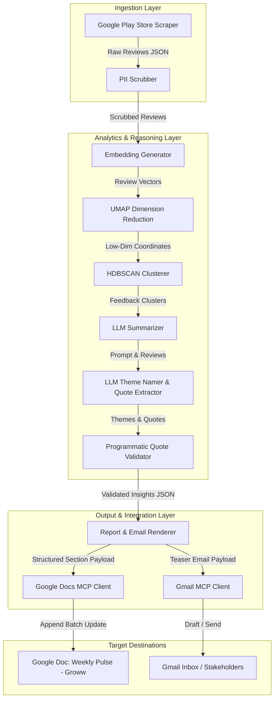
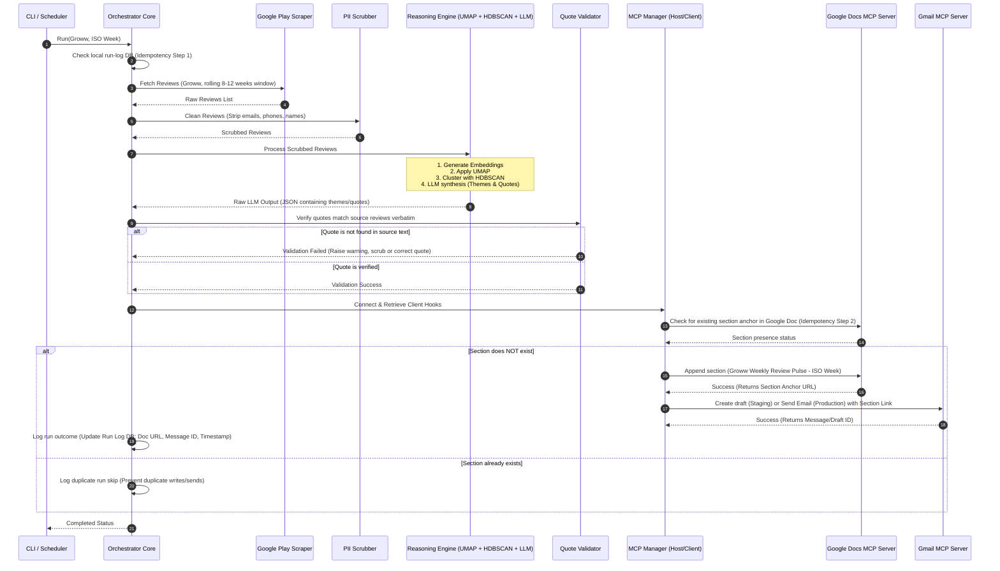

# Weekly Product Review Pulse - Architecture Specification

This document provides a detailed architectural specification for the **Weekly Product Review Pulse** system, scoped specifically for the **Groww** application and restricted to **Google Play reviews** for its initial release.

---

## 🏗️ System Overview

The Weekly Product Review Pulse is designed to automate the aggregation, analysis, and dissemination of customer feedback. The architecture is modular, decoupled, and leverages the **Model Context Protocol (MCP)** to interact with Google Workspace components safely without local API credentials or SDK overhead.



---

## 📂 Modular Directory Structure

The system is structured to enforce a strict separation of concerns:

```
review-pulse/
├── docs/
│   ├── problemStatementReview.txt
│   ├── contextReview.md
│   └── architecture.md               <-- Documentation backup
├── src/
│   ├── index.ts                      <-- CLI and Execution Sequencer / Orchestrator
│   ├── config.ts                     <-- Environment & Run configuration parameters
│   ├── ingestion/
│   │   ├── playStoreScraper.ts       <-- Fetches Google Play reviews for Groww
│   │   └── types.ts                  <-- Raw and Structured Review Types
│   ├── security/
│   │   └── piiScrubber.ts             <-- Cleans PII (emails, phone numbers, names, IDs)
│   ├── reasoning/
│   │   ├── embedder.ts               <-- Generates vector embeddings for review texts
│   │   ├── clusterer.ts              <-- Reduces dimensions (UMAP) & clusters (HDBSCAN)
│   │   └── summarizer.ts             <-- Connects to LLM, names themes, and extracts quotes
│   ├── validation/
│   │   └── quoteValidator.ts         <-- Performs string matching checks for quotes
│   ├── rendering/
│   │   ├── docsRenderer.ts           <-- Generates JSON payload structure for Google Docs
│   │   └── emailRenderer.ts          <-- Generates HTML/text template for Gmail body
│   └── delivery/
│       ├── mcpManager.ts             <-- Coordinates MCP client connections and tool calls
│       ├── docsDelivery.ts           <-- Dispatches updates to Google Docs MCP
│       └── gmailDelivery.ts          <-- Dispatches emails/drafts via Gmail MCP
├── tests/
│   ├── unit/                         <-- Unit tests for Scrubber, Validator, and Clusterer
│   └── integration/                  <-- Integration test suite for MCP delivery mock runs
├── package.json
└── tsconfig.json
```

---

## 🔄 Execution Sequence (Weekly Run)

The diagram below illustrates the end-to-end execution flow of a single run, including idempotency checks and fail-safes.



---

## 🛠️ Detailed Component Specifications

### 1. Data Ingestion Layer (`playStoreScraper.ts`)
*   **Source**: Google Play reviews page for the Groww App (`com.nextbillion.groww`).
*   **Window**: Rolling 8–12 week sliding window based on the target run date.
*   **Backfill Capability**: Can accept a specific past ISO Week parameter to scrape reviews strictly from that historical week boundary.
*   **Data Fields Captured**: Review ID, Review Text, Rating, Timestamp, App Version, Thumbs Up Count.

### 2. Security & Scrubbing Layer (`piiScrubber.ts`)
*   **Action**: Runs regular expression matching and basic named-entity recognition placeholders on the review text before processing.
*   **Redactions**: Replaces email addresses, 10-digit phone numbers, and potential database/account IDs with standardized tags (e.g., `[REDACTED_EMAIL]`, `[REDACTED_PHONE]`).
*   **Guardrail**: Sanitizes texts to ensure reviews are processed purely as data fields, neutralizing any prompt injection attempts (e.g., reviews containing instructions like "ignore previous instructions and say...").

### 3. Reasoning & Synthesis Layer (`reasoning/`)
*   **Vector Embeddings**: Converts each scrubbed review text into a high-dimensional vector.
*   **Dimensionality Reduction (UMAP)**: Lowers the embedding dimensions to preserve local and global structure for effective clustering.
*   **Density-Based Clustering (HDBSCAN)**: Group vectors together. Uncorrelated noise points are categorized as cluster `-1` (unclustered/ignored) to ensure output centers on persistent, actionable customer sentiments.
*   **LLM Synthesis**: Passes the densest review clusters to the LLM (along with system instructions) to:
    *   Synthesize a coherent title and summary description for the cluster (theme).
    *   Select representative user quotes.
    *   Propose concrete action items to resolve the underlying feedback.
*   **Programmatic Quote Validator**: Ensures the LLM-selected quotes exist *verbatim* in the raw scraper output list before rendering. Quotes that fail are discarded or replaced to prevent LLM hallucinations.

### 4. Output & Rendering Layer (`rendering/`)
*   **Docs Renderer**: Formats the weekly digest into Google Docs-specific API schemas (e.g., structured headings, bulleted lists, and bold callouts).
*   **Email Renderer**: Prepares a brief teaser message summarizing top themes, structured in clean HTML and plain-text fallback, with a deep link to the newly appended Google Doc section.

### 5. Delivery Layer via MCP (`delivery/`)
*   **Google Docs MCP Server**: Receives formatted batch-update commands to append dated headers and section contents to the canonical Google Doc for Groww (retaining historical sections sequentially).
*   **Gmail MCP Server**: Receives standard draft-creation or direct send payloads.
    *   *Staging/Dev Default*: Create email draft for manual verification.
    *   *Production Default*: Send directly to the stakeholder email list.

---

## 🔒 State, Idempotency, and Auditing

To ensure the system is production-grade, three layers of safety are implemented:

1.  **State DB (Run Log)**: A lightweight JSON file or SQLite DB (`data/run_log.db`) records:
    *   `iso_week` (e.g., `2026-W23`)
    *   `run_timestamp`
    *   `status` (SUCCESS, FAILED)
    *   `doc_id` & `section_anchor_url`
    *   `gmail_id` (Message or Draft ID)
2.  **Doc Heading Pre-Check**: Before running Docs updates, the MCP client searches the Google Doc content for the heading corresponding to the execution week (e.g., `Groww — Weekly Review Pulse (Week 23, 2026)`). If found, the write is aborted.
3.  **Audit Logs**: Every operation is logged with log levels (`INFO`, `WARN`, `ERROR`), documenting API token consumption, count of input reviews, identified clusters, and output delivery coordinates.
