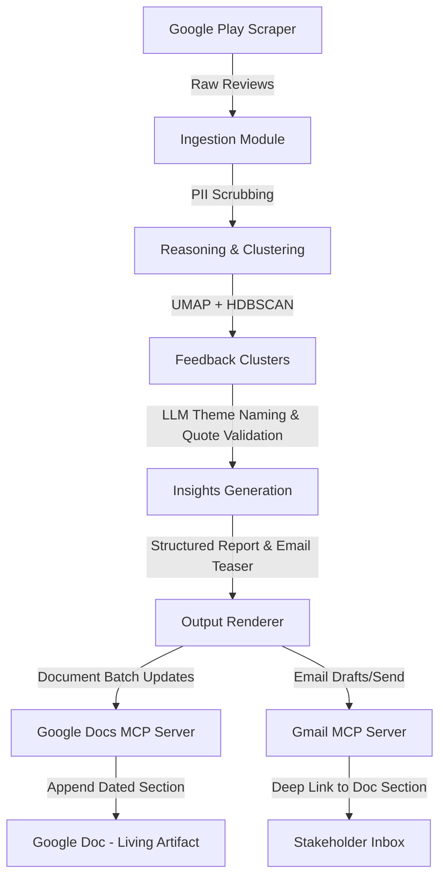

# Weekly Product Review Pulse - Context Review

This document summarizes the core context, objectives, system requirements, architecture, and scope defined in [problemStatementReview.txt](file:///c:/Users/aishw/Documents/Review%20Analysis/docs/problemStatementReview.txt) for the **Weekly Product Review Pulse** project.

---

## 🎯 Objectives & Vision

The core goal is to build an automated, weekly system ("pulse") that aggregates public Google Play reviews for the Groww app, analyzes them to find key themes and quotes, and delivers a consolidated one-page insight report to stakeholders.

### Target Products (Initial Scope)
*   **Groww** (Google Play reviews only)

### Value Proposition
| Audience | Value Delivered |
| :--- | :--- |
| **Product Team** | Prioritize the product roadmap based on recurring feedback themes. |
| **Support Team** | Spot repeating complaints and quality/outage issues early. |
| **Leadership** | Obtain a high-level health snapshot tied directly to the customer's voice. |

---

## 🏗️ Architecture & Component Design

The system relies on a modular separation of concerns and uses the **Model Context Protocol (MCP)** to interact with Google Workspace instead of embedding API keys or direct REST client logic inside the application codebase.

### System Diagram

### Separation of Concerns

| Layer | Responsibility | Location/Module |
| :--- | :--- | :--- |
| **Data Retrieval** | Scrape Google Play customer-reviews RSS (8-12 weeks rolling window). | Ingestion Modules |
| **Reasoning** | Cluster feedback, name themes using an LLM, extract verbatim verified quotes, and generate action items. | Clustering & LLM Summarization |
| **Output Generation** | Format the structured report for Google Docs and compile the teaser text/HTML for Gmail. | Report & Email Renderer |
| **Human Delivery** | Deliver outputs to Google Docs and Gmail via MCP tools. | Google Docs & Gmail MCP clients |

> [!IMPORTANT]
> The agent acts strictly as an MCP host/client. It does **not** manage OAuth secrets or direct Google API calls. Authentication and execution credentials live inside the respective MCP servers' configuration.

---

## ⚙️ Key Requirements & Guardrails

*   **MCP-Based Delivery**: Appending reports to a single running Google Doc per product and sending emails must be performed using the Google Docs and Gmail MCP tools.
*   **Weekly Cadence & CLI**: The system is designed to run weekly (scheduled for Monday morning IST). A CLI must be provided to backfill any specific ISO week.
*   **Idempotency**: Re-running the pulse for a given product and ISO week must not duplicate Doc sections or send duplicate emails. This is enforced via stable section anchors in Google Docs and run-scoped email checks.
*   **Auditability**: All runs must log delivery identifiers (e.g., Doc heading link, Gmail message/draft IDs) and metadata to track what was sent, when, and for which week.
*   **PII & Security**: PII scrubbing must run on the review text prior to sending it to the LLM or publishing it. Reviews must be treated strictly as data, not instructions (preventing prompt injection).
*   **Quote Validation**: Real user quotes highlighted in the report must be validated programmatically to ensure they exist verbatim in the source review text.

---

## 🚫 Non-Goals

> [!WARNING]
> Keep the implementation tightly focused on the core problem statement. The following are explicitly out of scope:
> 1. Building a generic Google Workspace product beyond the specific Doc/Gmail integrations needed.
> 2. Real-time streaming analytics or BI dashboards.
> 3. Apple App Store reviews or other platforms (restricted to Google Play in the initial version).
> 4. Social media sources (e.g., Twitter, Reddit, etc.) for the initial version.
> 5. Storing Google OAuth secrets in the agent's codebase.

---

## 📝 Sample Report Structure

Each generated section appended to the product's running Google Doc should follow this structure:

### Groww — Weekly Review Pulse
*   **Period**: Rolling window of the last 8–12 weeks.
*   **Top Themes**:
    *   *App Performance & Bugs*: Descriptions (e.g., crash occurrences, timeouts).
    *   *Customer Support Friction*: Descriptions (e.g., ticket resolution speed).
    *   *UX & Feature Gaps*: Missing features or navigation issues.
*   **Real User Quotes** (Verbatim & validated):
    *   `"Quote 1..."`
    *   `"Quote 2..."`
*   **Action Ideas**:
    *   *Recommendation 1*: e.g., Scale infrastructure.
    *   *Recommendation 2*: e.g., Improve SLA visibility.
